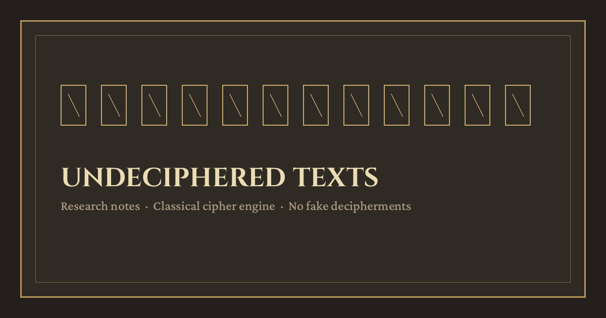

# Undeciphered Texts & Open Historical Ciphers



<!-- SVG fallback: docs/assets/readme-hero.svg -->

Research notes and a **classical cipher engine**.

**This repository does not claim any new decipherment of ancient scripts or unknown languages.**  
The `engine/` package provides classical cipher recovery, supplied-key cipher helpers, and bounded analysis tools with tests and fixtures. Famous undeciphered systems are documented for context and realistic contribution paths, not as overnight puzzles.

## Start here (recommendation)

Work **digitized historical ciphertexts in known languages** first, not Linear A or Voynich.

1. [DECODE / DECRYPT](https://de-crypt.org/), archival cipher images, keys, transcription / cryptanalysis tools.
2. [Crypto Cellar, Breaking German Army Ciphers](https://cryptocellar.org/bgac/), remaining public Enigma / Wehrmacht challenges.
3. Early-modern diplomatic / nomenclator letters marked non-decrypted in DECODE (and community catalogues built on it).

See [`docs/starter-projects.md`](docs/starter-projects.md) for concrete URLs and scoped projects.

## Quick start (engine)

Python **3.10+**. Core cipher routines use the standard library. Symbolic reverse engineering optionally uses Z3 through `requirements-synthesis.txt`; OCR uses a local backend.

```bash
# from repo root
python3 -m engine demo  # or: python -m engine demo              # recovers built-in known cases; writes DEMO.md
python -m pip install Pillow numpy  # required by the full image and neural test suite
python -m unittest discover -s tests -v
python -m engine analyze "Wkh kdueru ehoo udqj"
python -m engine solve caesar "Wkh kdueru ehoo udqj"
python -m engine solve keyed-vigenere EMUFPHZLRFAXYUSDJKZLDKRNSHGNFIVJYQTQUXQBQVYUVLLTREVJYQTMKYRDMFD --key PALIMPSEST --alphabet KRYPTOS --index K
python demos/run_demo.py           # same demo path; rewrites DEMO.md
python3 -m engine reverse-engineer LXFOPVEFRNHR --crib 0:ATTACK --max-period 5
python3 -m engine word-pattern "AB BA" --lexicon words.txt --max-nodes 10000
python3 -m engine.puzzles anagram listen --lexicon words.txt
python3 -m engine tools
python3 -m engine run condi XHYSCYEOPL --params '{"keyword":"STRANGE","initial_offset":25,"alphabet_shift":21}'
python3 -m engine route "LXFOPVEFRNHRLXFOPVEFRNHR"
python3 -m engine investigate LXFOPVEFRNHR --crib 0:ATTACK --max-checks 5000
```

`DEMO.md` is **generated by the demo run**, not a handwritten transcript.

`tools` lists connected helpers and searches with their required parameters. `run` accepts JSON parameters, explicit hexadecimal inputs for AES/ChaCha20, and integer inputs for RSA attacks. Supplied keys, supplied extraction rules, bounded unknown-key searches, and model inference have distinct modes. See the [tool interface](docs/tool-interface.md).

The [neural router](docs/neural-upgrades.md), **Bob the Neural Net**, ranks known cipher families using residual networks and bounded cryptanalytic trial features. Training combines supervised label smoothing, hard-example curriculum weights, and paired dropout consistency. Compatible warm starts can also use [frozen-teacher distillation](docs/bob-distillation-2026-10-03.md) on generated training examples. A worse candidate fails promotion. Its development benchmark and artifact-specific audit are recorded separately; family recognition does not establish a plaintext. The [primary-source Bob research plan](docs/bob-research-2026-10-03.md) proposes further experiments rather than claiming those proposed upgrades are implemented. The [generator probe](docs/bob-generator-2026-10-04.md) is the first of those measurements: the same frozen format 5 weights, scored on broader Enigma and M-209 settings, with no weight replacement.

The [investigation planner](docs/solver-reasoning.md) connects crib inference, affine search, transposition search, and numeric Morse constraints. It records premises, checks, contradictions and next actions under one search budget. Curiosity, caution, frustration and happiness are explicitly simulated telemetry. Correctness stays unknown until independent evidence exists; speed earns a bonus only on independently correct evaluations.

The [ten persona solvers](docs/persona-solvers.md) add complementary policies. Emperor tests systematic hypotheses, Inheritance uses supplied clues, Hallucinogens explores bounded cipher/layout compositions, and Pacifist computes exact affine consensus. Detective places a supplied crib, Cartographer searches transposition layouts, and Mechanic connects progressive-key, autokey and Hill constraints.

Normal Human Man provides a plain Caesar and rail-fence baseline. Adversary searches for alternatives consistent with the same evidence; Skeptic separately checks candidates against reserved evidence. A shared council merges candidates under one budget. Personality affects narration, never mathematical checks or answer vocabulary. Earlier sentence-preference interfaces remain separate, and voting does not verify plaintext.

## When a new unsolved cipher arrives

Start with [target triage](docs/target-triage.md) to check current solution status, data access, and useful constraints. The [Truppenschlüssel residue count](docs/truppenschluessel-residue-2026-10-04.md) separates the 27 July 2026 failure page into 30 unmarked rows and 11 later breaks. It is a count, not an attack. The [dated shortlist](docs/target-shortlist.json) records evidence and next steps. No checked named unsolved target is established as easy. Archival keys, related letters, and reliable transcription offer the most concrete starting paths.

Use the [case workflow](docs/WORKFLOW.md) to preserve the original transcription, document its source and alphabet, separate confirmed cribs from guesses, and save each analysis with its inputs and limits.

```bash
python3 -m engine.case_workflow init archive-letter --ciphertext-file letter.txt --source-url https://example.org/archive/letter
python3 -m engine.case_workflow validate cases/archive-letter
python3 -m engine.case_workflow analyze cases/archive-letter
# Review case.json: explicitly select the alphabet and record sourced, confirmed cribs.
python3 -m engine.case_workflow reverse cases/archive-letter --max-period 16
python3 -m engine.case_workflow investigate cases/archive-letter --max-checks 5000
python3 -m engine.case_workflow verify cases/archive-letter --candidate-file proposed-plaintext.txt
```

Cases progress through intake, transcription review, analysis, bounded hypotheses, and independent validation. Runs keep source and manifest snapshots, SHA-256 hashes, settings, code versions, and explicit completion status. Search output never marks a case solved. Raw case files stay local by default; publish a reviewed, reproducible result separately.

K4 is one research objective alongside broader open targets and Bob development.
The [new conditional composition run](docs/k4-focus/model-experiments-2026-10-03.md)
tests autokey and periodic models around ragged transpositions, with a disclosed
clue reserved for verification. The [smaller-target attempt](docs/easy-unsolved-attempt-2026-10-03.md)
records executed attacks and their limits. Neither English plausibility nor a
forward replay establishes an unknown historical reading.

For exact constraints and compositions, install the optional [symbolic engine](docs/cipher-synthesis.md):

```bash
python3 -m pip install -r requirements-synthesis.txt
python3 -m engine reverse-engineer GUEXZIZICPZCPVOIXZIGSIZZI --crib 0:ATTACK --symbolic --model affine --layout reverse
```

It tests cipher families, unknown Quagmire alphabets, and layout stages within explicit bounds. A letter is shown as forced only after an alternate-value satisfiability check. Example keys, ambiguous positions, incompatible models, and unfinished searches have distinct outputs.

## What the engine does / does not

Full inventory of solvers and analysis tools (classical, keyed Vigenère, columnar, crib, German scorer, neural trigram, script tools, EM aligner, clustering, HMM, mutual information, compression score, beam search, mural analyzer, OCR, and helpers): [`docs/CATALOG.md`](docs/CATALOG.md).

| Does | Does not |
| --- | --- |
| Caesar (all shifts + English unigram score) | Decipher Linear A, Indus, Rongorongo, Phaistos, Voynich, … |
| Vigenère (Kasiski, IC, Friedman, column Caesar + n-grams) | Break secure modern cryptography |
| Keyed Vigenère (keyword-mixed alphabet; known key), recovers published Kryptos K1, not K4 | Claim Kryptos K4 or any unread passage |
| Quagmire I, II, III, and IV with supplied keys; checked against published ACA examples | Recover an unknown Quagmire key |
| AES-128/192/256 block decryption and ChaCha20 with supplied keys | Discover an unknown AES or ChaCha20 key |
| RSA common-modulus and bounded close-prime recovery on documented weak instances | Claim a general break of RSA |
| Wiener recovery for a documented weak private exponent | Treat arbitrary RSA keys as vulnerable |
| Published ACA helpers, bounded Morse-map inference, and transposition ensembles | Treat a top-ranked candidate as a unique historical reading |
| Word-pattern constraint search and crib-based model inference | Treat a compatible hypothesis as a decipherment |
| Exact symbolic constraints, unknown alphabets, and layout compositions | Prove an untested cipher family or crib is correct |
| Local image OCR through Tesseract or optional Apple Vision | Interpret an undeciphered script from an image |
| Sudoku, eight-direction word searches, and supplied-lexicon anagrams | Claim a unique puzzle answer after an unfinished search |
| Simple substitution (frequency seed + annealing + hill-climb) | Claim a script or language is “solved” |
| Known-answer vectors and recovery fixtures with SHA-256 checks | Invent historical decipherments |

## Repository layout

| Path | Role |
| --- | --- |
| [`engine/`](engine/) | Classical cryptanalysis package + CLI |
| [`engine/solvers/`](engine/solvers/) | Cipher modules; see the catalog for the full inventory |
| [`docs/CATALOG.md`](docs/CATALOG.md) | Deep catalog: every solver and analysis tool (path, role, what tests proved, what it does not do) |
| [`docs/kryptos-k1.md`](docs/kryptos-k1.md) | Published Kryptos K1 system and the known-key check |
| [`docs/quagmire-i.md`](docs/quagmire-i.md), [`quagmire-ii.md`](docs/quagmire-ii.md), [`quagmire-iii.md`](docs/quagmire-iii.md) | ACA Quagmire I, II, and III examples with plaintext hash certificates |
| [`docs/aes.md`](docs/aes.md), [`chacha20.md`](docs/chacha20.md) | Modern supplied-key primitives with official test vectors |
| [`docs/rsa-common-modulus.md`](docs/rsa-common-modulus.md), [`rsa-fermat.md`](docs/rsa-fermat.md) | Public-parameter recovery under specific RSA weaknesses |
| [`docs/word-pattern.md`](docs/word-pattern.md), [`reverse-engineering.md`](docs/reverse-engineering.md) | Constraint search and bounded cipher-model inference |
| [`docs/cipher-synthesis.md`](docs/cipher-synthesis.md) | Optional Z3 constraints and conditional plaintext consensus |
| [`docs/tool-interface.md`](docs/tool-interface.md), [`solver-reasoning.md`](docs/solver-reasoning.md) | Connected solver invocation and bounded investigative planning |
| [`docs/neural-upgrades.md`](docs/neural-upgrades.md), [`neural-training.md`](docs/neural-training.md) | Family recognition, training objectives, benchmarks and quality gates |
| [`docs/cross-repo-learning.md`](docs/cross-repo-learning.md) | Verified cross-repository audit and optional Fins-inspired council budget allocation |
| [`docs/WORKFLOW.md`](docs/WORKFLOW.md), [`cases/README.md`](cases/README.md) | Intake, provenance, bounded runs, and review of unsolved cases |
| [`schemas/cipher-case.schema.json`](schemas/cipher-case.schema.json), [`templates/unsolved-case.json`](templates/unsolved-case.json) | Machine-readable case format and editable template |
| [`docs/ocr-backends.md`](docs/ocr-backends.md) | Local image transcription backends and setup |
| [`docs/puzzles.md`](docs/puzzles.md) | Bounded Sudoku, word search, and anagrams |
| [`docs/target-triage.md`](docs/target-triage.md), [`target-shortlist.json`](docs/target-shortlist.json) | Dated source research and feasibility judgments for open targets |
| [`docs/research-notes/README.md`](docs/research-notes/README.md) | <!-- research-note-count:start -->9 dated primary-source case notes<!-- research-note-count:end -->, corpus limits and proposed experiments for undeciphered scripts and historical ciphers |
| [`docs/research-notes/dagapeyeff-2026-10-05.md`](docs/research-notes/dagapeyeff-2026-10-05.md) | D'Agapeyeff cipher (1939): <!-- dagapeyeff-status:start -->Unsolved. Plaintext recovered: 0 percent. 28 of 34 hypothesis families listed (82 percent) are closed with shown power or excluded by a count; 6 are open. Reviewed through 2026-10-06.<!-- dagapeyeff-status:end --> |
| [`docs/k4-focus/evidence-2026-10-03.md`](docs/k4-focus/evidence-2026-10-03.md), [`model-experiments-2026-10-03.md`](docs/k4-focus/model-experiments-2026-10-03.md) | K4 source and clue audit, current custody, and executed bounded composition tests |
| [`docs/easy-unsolved-attempt-2026-10-03.md`](docs/easy-unsolved-attempt-2026-10-03.md) | Reproducible smaller open-target attacks, controls, ambiguity and verification limits |
| [`docs/ctf-triage-2026-10-03.md`](docs/ctf-triage-2026-10-03.md) | Public puzzle fixtures and organizer first-solve records; all ten already recorded solved at this check |
| [`engine/data/neural_train_public.txt`](engine/data/neural_train_public.txt) | 1,916,398 public-domain letters behind the default English quadgram model ([drill](docs/logs/solver-strong-2026-10-05.md)) |
| [`engine/data/english.txt`](engine/data/english.txt) | Prose for the legacy n-gram model that recorded probes replay |
| [`tests/test_recover.py`](tests/test_recover.py) | Round-trip + recovery tests |
| [`demos/run_demo.py`](demos/run_demo.py) | Demo entry that rewrites `DEMO.md` |
| [`DEMO.md`](DEMO.md) | Last demo witness (ciphertext → recovered PT) |
| [`docs/landscape.md`](docs/landscape.md) | Undeciphered & partly deciphered scripts/texts |
| [`docs/closest.md`](docs/closest.md) | “Closest to breakthrough” (hype-checked, sourced) |
| [`docs/recent-cracks.md`](docs/recent-cracks.md) | Recent / famous cracks and methods |
| [`docs/starter-projects.md`](docs/starter-projects.md) | Open targets with data URLs |
| [`docs/methods.md`](docs/methods.md) | How amateurs make progress |
| [`docs/engine.md`](docs/engine.md) | SOTA vs what this engine actually does |
| [`docs/external.md`](docs/external.md) | External tools / papers (pointers; not vendored) |
| [`docs/sources.md`](docs/sources.md) | Consolidated URLs |
| [`docs/vesuvius-scrolls.md`](docs/vesuvius-scrolls.md) | Vesuvius Challenge context (known Greek ≠ unknown script) |
| [`docs/ai-already-helped.md`](docs/ai-already-helped.md) | Published AI-assisted historical cryptanalysis |
| [`docs/AI-AGENTS.md`](docs/AI-AGENTS.md) | Rules for AI (and human) editors |
| [`docs/QUALITY.md`](docs/QUALITY.md) | Citation / testing / honesty bar |
| [`docs/TESTING.md`](docs/TESTING.md) | How to run tests; what green means |
| [`docs/UI-UX.md`](docs/UI-UX.md) | CLI / docs presentation expectations |
| [`CONTRIBUTING.md`](CONTRIBUTING.md) | Contribution ground rules |
| [`LICENSE`](LICENSE) | MIT |
| [`docs/NOVELTY.md`](docs/NOVELTY.md) | Claim labels (sourced / hypothesis / not a decipherment) |
| [`docs/ERROR-LOG.md`](docs/ERROR-LOG.md) | Pointer to append-only failure log |
| [`docs/logs/errors.md`](docs/logs/errors.md) | Real failures only (JPEG MCP bug, env gaps, solver fails) |
| [`docs/image-reading.md`](docs/image-reading.md) | OCR vs ink detection vs unwrapping (honest limits) |
| [`docs/logs/`](docs/logs/) | Dated research notes (not claims) |
| [`docs/assets/`](docs/assets/) | Hero art (SVG; JPEG only if verified binary blob) |

## Architecture (engine)

| Piece | Role |
| --- | --- |
| `alphabet.py`, `stats.py`, `language.py` | Letter stream, IC, Friedman, Kasiski, n-grams |
| `ciphers.py` / `fixtures.py` | Forward maps + known PT/CT for tests & demo |
| `solvers/` | One module per cipher |
| `cli.py` / `demo.py` | `python -m engine` entry points |

## Guidelines

- [`docs/AI-AGENTS.md`](docs/AI-AGENTS.md), cite URLs; no invented decipherments; logs ≠ claims; solvers need tests.
- [`docs/QUALITY.md`](docs/QUALITY.md), every historical claim needs a source; mark hypotheses; verify image magic bytes.
- [`docs/TESTING.md`](docs/TESTING.md), unittest + demo witness.
- [`docs/UI-UX.md`](docs/UI-UX.md), CLI and docs presentation.
- [`CONTRIBUTING.md`](CONTRIBUTING.md), PR ground rules.
- [`docs/NOVELTY.md`](docs/NOVELTY.md), claim labels; no hallucinated readings.
- [`docs/ERROR-LOG.md`](docs/ERROR-LOG.md) / [`docs/logs/errors.md`](docs/logs/errors.md), real failures only.

## License note

Personal research notes. Linked museum / archive resources keep their own terms.
