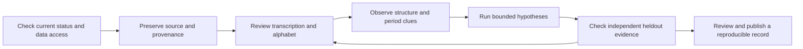

# Working on an unsolved cipher

Use a case to preserve the source, record assumptions, run bounded models, and compare a proposed reading against independent evidence. The workflow never changes `status` from `unsolved`. A compatible model is a candidate. A copied source URL records provenance but does not establish the source's accuracy or independence.



Start with [target triage](target-triage.md) and the [dated shortlist](target-shortlist.json). Prefer evidence that narrows a real search: readable source images, reliable transcription, likely language, a constrained cipher family, related messages, and independent checks. A database label such as non-decrypted can lag a published or contemporary solution. Confirm current status before treating a target as open.

The rules in [AI-AGENTS.md](AI-AGENTS.md), [QUALITY.md](QUALITY.md), [TESTING.md](TESTING.md), and [verification-certificates.md](verification-certificates.md) still apply. No command publishes a case. Keep private or unpublished material local unless you intend to share it.

## Intake and observations

Save the transcription as UTF-8 text, then run from the repository root:

```sh
python3 -m engine.case_workflow init my-case --ciphertext-file /path/to/transcription.txt --source-url https://example.org/source
python3 -m engine.case_workflow validate cases/my-case
python3 -m engine.case_workflow analyze cases/my-case
```

`--root /path/to/cases` selects a different case collection. Slugs use lowercase letters and digits with single hyphens. Existing case directories are never overwritten. Intake accepts at most 1 MiB of nonempty UTF-8 text. It copies exact bytes to `source/ciphertext.txt`, records their SHA-256 and byte count in `case.json`, and creates a separate `source/intake.json` anchor. Source and anchor files are read only by default. Read-only mode and hashes detect ordinary accidental changes; they are not a security boundary against someone rewriting every file.

Edit `case.json` to describe provenance, language assumptions, alphabet, transcription alternatives, and evidence. Leave copied source bytes unchanged. Create a separate case for a changed transcription and link the earlier case in your notes. `validate` checks required fields, safe paths, UTF-8, and both input hash records. It validates input integrity, not a decipherment. The [JSON Schema](../schemas/cipher-case.schema.json) is the authoring contract; runtime checks use the standard library and also check the source files. The [template](../templates/unsolved-case.json) illustrates the fields with placeholder hash values. Use `init` to generate a usable case and anchor.

The default alphabet is `unknown` with normalization `none`. Analysis preserves Unicode characters and whitespace-delimited tokens, labels observed frequencies, and leaves `normalized_latin` null. An unknown script never becomes Latin text automatically. For an explicitly A-Z cipher, set:

```json
"alphabet": {
  "kind": "latin",
  "symbols": ["A", "B", "C", "D", "E", "F", "G", "H", "I", "J", "K", "L", "M", "N", "O", "P", "Q", "R", "S", "T", "U", "V", "W", "X", "Y", "Z"],
  "normalization": "ascii_letters"
}
```

This declaration makes letter inference use uppercase A-Z and omit spaces, digits, and punctuation. Non-ASCII alphabetic characters are rejected. Original bytes and tokens remain in the snapshot. Custom symbols may describe a transcription for observation, but the current inference models require A-Z.

Explicit Latin analysis also records index of coincidence, the Friedman estimate, Kasiski votes, column coincidence, and top one- through four-letter n-grams. `analyze --max-period 16` controls the period bound, at most 128. These metrics examine at most the first 8,192 normalized letters. Reports disclose total letters, examined letters, and whether sampling occurred. Unicode observations cover the original source. Friedman uses English coincidence assumptions; these statistics do not identify a language or prove a cipher family.

## Confirmed training cribs and bounded hypotheses

Add aligned plaintext evidence to `cribs`. Offsets are zero-based positions in normalized A-Z plaintext for these models. A confirmed crib requires a cited source URL. A tentative crib remains a hypothesis and is excluded from model fitting. For example:

```json
"cribs": [
  {
    "offset": 0,
    "plaintext": "KNOWN",
    "status": "confirmed",
    "source_url": "https://example.org/independent-evidence",
    "note": "Explain how this alignment is known."
  }
]
```

```sh
python3 -m engine.case_workflow reverse cases/my-case --max-period 4
python3 -m engine.case_workflow reverse cases/my-case --symbolic --max-period 4 --timeout 5 --max-checks 10000
```

The baseline calls the actual [reverse engineering API](reverse-engineering.md): 312 invertible affine combinations, a partial substitution map, and Vigenere/Beaufort periods through the requested bound. It accepts at most 512 A-Z letters and periods 1 through 128. At least one confirmed training crib is required. Inconsistent or out-of-range cribs fail input validation.

Symbolic mode calls the actual [Z3 synthesis API](cipher-synthesis.md). It requires the optional environment described there and `requirements-synthesis.txt`. Select families with repeated `--model` options: `affine`, `caesar`, `vigenere`, `beaufort`, `substitution`, `quagmire-i`, `quagmire-ii`, or `quagmire-iii`. Repeated `--layout identity` and `--layout reverse` select layouts; `--columnar-width 5` adds a columnar layout. The default families are affine, Vigenere, Beaufort, and substitution with identity and reverse layouts. Bounds include at most 1,024 model classes, 100,000 solver checks, and a shared timeout in `(0, 60]` seconds. Model construction and filesystem work are bounded separately and may add time around solver checks.

The report distinguishes `candidates`, `failed` (no compatible model in the completed specified search), and `incomplete`. Timeout or check exhaustion remains incomplete. If Z3 is absent, the workflow still saves an `unavailable` report with `executed: false` and `incomplete: true`. Returned example keys, fitted cribs, forced letters, and consensus describe only the selected model families and assumptions. They do not prove a historical reading. Every report retains `claimed_plaintext: null`.

## Compare a supplied candidate with heldout evidence

For a combined investigation with optional confirmed cribs, run:

```sh
python3 -m engine.case_workflow investigate cases/my-case --max-checks 5000 --max-candidates 20
```

This calls the [investigation planner](solver-reasoning.md), tests crib-compatible models or finite affine keys, then shares the remaining budget across transposition families. Neural family probabilities are optional advice. The case path requires a declared Latin alphabet and 4 through 512 A-Z letters. Tentative cribs, heldout cribs, and reference hashes never enter this search. Direct `python3 -m engine investigate` also supports numeric Morse input with a lexicon or aligned evidence; its decoded-character coordinates include spaces and require their own interpretation.

The ledger records premises, executed tools, rejected transforms, missing evidence and next actions. Simulated affect is display telemetry; unknown historical correctness earns no happiness reward. A partial search remains incomplete and every candidate remains unverified. When neural advice is used, the exact router artifact is saved in `snapshot/router_weights.json` with its SHA-256. A model changing during the run prevents publication of a mismatched snapshot. Workflow version 1.1 also records NumPy's distribution version and all engine/solver source hashes.

Add `--solver-profile council` to run the complementary [persona strategies](persona-solvers.md) under the same budget and source/model snapshot rules. Only confirmed training cribs are passed to the council; tentative cribs, reserved validation cribs and the expected plaintext hash remain outside that run. Use `verify` separately for case evidence. The separate neural router is Bob the Neural Net; persona labels do not change its identity or correctness criteria.

Reserve independent cribs in `validation.heldout_cribs` before fitting models. They use the same fields as training cribs and are never passed to inference. Confirmed heldout cribs are compared independently; tentative entries are excluded. For Latin normalization, positions refer to A-Z candidate letters. For cases without Latin normalization, positions refer to unchanged Unicode code points, including whitespace.

For an independently published complete plaintext, set `validation.known_plaintext_url` and `validation.expected_plaintext_sha256`. The hash must describe exact candidate UTF-8 bytes, including capitalization, spaces, and final newline. A declared expected hash requires a reference URL. Then supply a candidate file:

```sh
python3 -m engine.case_workflow verify cases/my-case --candidate-file /path/to/proposed-plaintext.txt
```

`verify` preserves an exact candidate snapshot and hash and reports one of:

- `rejected`: a declared reference hash or confirmed heldout crib disagrees.
- `reference-match`: the exact bytes match the declared reference hash and all supplied confirmed heldout checks pass.
- `crib-supported`: confirmed heldout checks pass, with no full reference hash supplied.
- `unchecked`: no full reference hash or confirmed heldout evidence was supplied.

These labels describe comparisons with declared evidence. The tool does not retrieve, authenticate, or independently assess reference URLs. Human review must check the published plaintext and exact hash, transcription fidelity, crib alignment, and the independence of heldout evidence. A crib reused to tune a hypothesis is no longer independent heldout evidence. Reencryption verifies consistency with an algorithm and key, while a historical decipherment also needs external linguistic and source evidence. Secure modern ciphers generally require their keys or a specific documented weakness. No workflow promises that an unsolved case is solvable.

## Reproducible records

Each analysis, inference attempt, or candidate comparison creates a new `runs/<UTC-time>-<operation>-<random-id>/` directory. It contains read-only input snapshots, `report.json`, and a manifest published last. Verification also snapshots `plaintext-candidate.txt`. The manifest records input and candidate hashes where applicable, the exact metadata snapshot, UTC time, parameters and bounds, workflow version, Python implementation/version, optional Z3 distribution version, current Git commit and dirty flag if available, source module hashes, a hash of the sorted certificate file fingerprints, and the report hash. Git identity alone does not describe uncommitted code, so module hashes are included. A directory without a manifest is an unfinished artifact set. New runs never overwrite earlier ones.

The stage indicates the latest operation: `intake`, `analyzed`, `hypotheses`, or `validation`. It is an organizational label, not a confidence score or solved state. Keep notes about human review with the case. Commit a case only when its sources and candidate material are appropriate to make public. The repository contains no personal unknown ciphertext as a workflow fixture; tests create temporary cases.

```sh
python3 -m unittest tests.test_case_workflow -v
```
